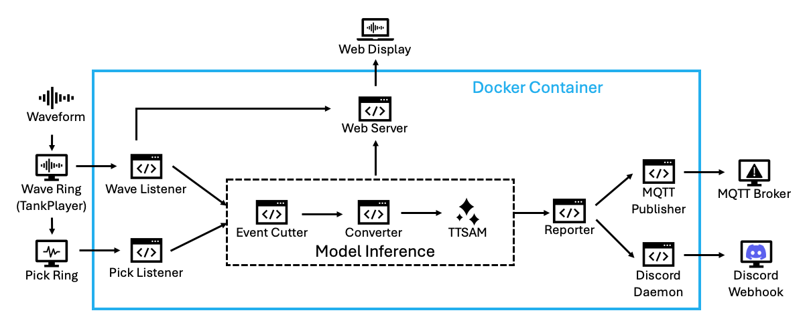

# TT-SAM Realtime System

A real-time seismic intensity prediction system that utilizes deep learning to process seismic waveforms and predict ground motion intensities across Taiwan.



## Features

- Real-time seismic waveform processing
- Deep learning-based ground motion prediction
- Integration with Earthworm seismic processing system
- Web-based visualization interface
- MQTT support for real-time notifications
- Multi-station processing capability

## Requirements

- Earthworm
- MQTT broker
- Docker 

## Installation

1. Clone this repository
```bash
git clone https://github.com/SeisBlue/TTSAM_Realtime.git
```

2. Pull the Docker image:
```bash
docker pull seisblue/ttsam-realtime
```
3. Prepare the required data files in the `data` directory:
    - `site_info.txt`: Station information
      ```
      Station Channel Location Latitude Longitude Elevation Depth Azimuth Start_time End_time Constant 
      ALS HLE 10 23.508380 120.813410 2417.00 0.00 90.0 2018-08-08 2599-12-31 3.27E-6 
      ALS HLN 10 23.508380 120.813410 2417.00 0.00 0.0 2018-08-08 2599-12-31 3.24E-6 
      ALS HLZ 10 23.508380 120.813410 2417.00 0.00 0.0 2018-08-08 2599-12-31 3.25E-6 
      ```
    - `eew_target.csv`: Target stations for prediction
      ```
      network,station,station_zh,longitude,latitude,elevation
      CWB_SMT,TAP,臺北地震站,121.514,25.038,16
      TSMIP,A024,板橋地震站,121.475,25.019,14
      CWASN,NTS,淡水地震站,121.449,25.164,15
      ```
    - `Vs30ofTaiwan.csv`: VS30 data for Taiwan
      ```
      x,y,Vs30,x_97,y_97,lon,lat
      287760,2802000,534.43737793,288590.5292444,2801796.6794629595,121.3833232712489,25.324688719187737
      287840,2802000,534.24029541,288670.5304836,2801796.67998464,121.38411791685077,25.324686654878782
      287920,2802000,534.02142334,288750.5317228,2801796.6805063197,121.38491256236529,25.324684586285322
      ```
4. Place trained model in the `model` directory:
    - `ttsam_trained_model_11.pt` ([TT-SAM](https://github.com/JasonChang0320/TT-SAM))

5. MQTT configuration file:
    - `ttsam_config.json`
       ```json
       "mqtt": {
         "username": "ttsam",
         "password": "ttsam",
         "host": "0.0.0.0",
         "port": 1883,
         "topic": "ttsam"
       }
        ```
## Usage

Run the system with:

```bash
docker run \
-v $(pwd):/workspace \
-v /opt/Earthworm/run/params:/opt/Earthworm/run/params:ro \
--rm \
--ipc host \
--net host \
--name ttsam-cpu \
seisblue/ttsam-realtime \
/opt/conda/bin/python3 /workspace/ttsam_realtime.py [options]
```

Options:
- `--mqtt`: Connect to MQTT broker, default: `False`
- `--config`: MQTT configuration file, default: `ttsam_config.json`
- `--web`: Run the web server, default: `False`
- `--host`: Web server IP, default: `0.0.0.0`
- `--port`: Web server port, default: `5000`

## Update

Pull the latest code:
```bash
git pull
```

Pull the latest Docker image:
```bash 
docker pull seisblue/ttsam-realtime
```

## System Components

- Wave Listener: Processes incoming seismic waveforms
- Pick Listener: Handles phase picks and triggering
- Model Inference: Runs deep learning prediction
- Web Server: Provides visualization interface
- MQTT Client: Broadcasts predictions

## Model Architecture

[TT-SAM](https://github.com/JasonChang0320/TT-SAM)

The system uses a deep learning model combining:
- CNN for waveform processing
- Transformer for station data integration
- MDN (Mixture Density Network) for uncertainty estimation

## References
Münchmeyer, J., Bindi, D., Leser, U., & Tilmann, F. (2021). The transformer earthquake
alerting model: A new versatile approach to earthquake early warning. Geophysical Journal
International, 225(1), 646-656.
(https://academic.oup.com/gji/article/225/1/646/6047414)

Liu, Kun-Sung, Tzay-Chyn Shin, and Yi-Ben Tsai. (1999). A free-field strong motion
network in Taiwan: TSMIP. Terrestrial, Atmospheric and Oceanic Sciences, 10(2), 377-396.
(http://tao.cgu.org.tw/index.php/articles/archive/geophysics/item/308)

Akazawa, T. (2004, August). A technique for automatic detection of onset time of P-and Sphases
in strong motion records. In Proc. of the 13th world conf. on earthquake engineering
(Vol. 786, p. 786). Vancouver, Canada.
(https://www.iitk.ac.in/nicee/wcee/article/13_786.pdf)

Kuo, C. H., Wen, K. L., Hsieh, H. H., Lin, C. M., Chang, T. M., & Kuo, K. W. (2012). Site
classification and Vs30 estimation of free-field TSMIP stations using the logging data of
EGDT. Engineering Geology, 129, 68-75.
(https://www.sciencedirect.com/science/article/pii/S0013795212000397)

Lee, C. T., & Tsai, B. R. (2008). Mapping Vs30 in Taiwan. TAO: Terrestrial, Atmospheric
and Oceanic Sciences, 19(6), 6.
(https://www.researchgate.net/profile/Chyi-Tyi-Lee-2/publication/250211755_Mapping_Vs30_in_Taiwan/links/557fa82608aeb61eae262086/Mapping-Vs30-in-Taiwan.pdf)

Huang, H. H., Wu, Y. M., Song, X., Chang, C. H., Lee, S. J., Chang, T. M., & Hsieh, H. H.
(2014). Joint Vp and Vs tomography of Taiwan: Implications for subduction-collision
orogeny. Earth and Planetary Science Letters, 392, 177-191.
(https://www.sciencedirect.com/science/article/pii/S0012821X14000995)